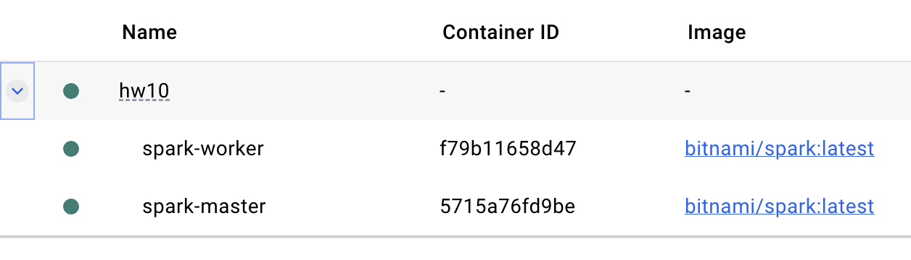
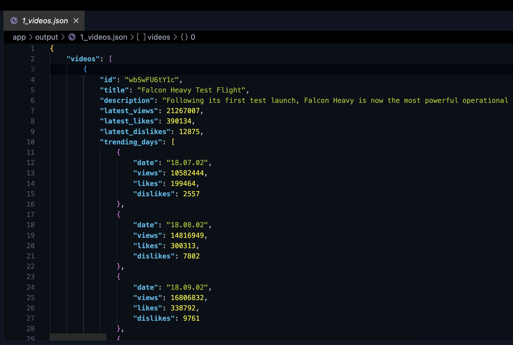
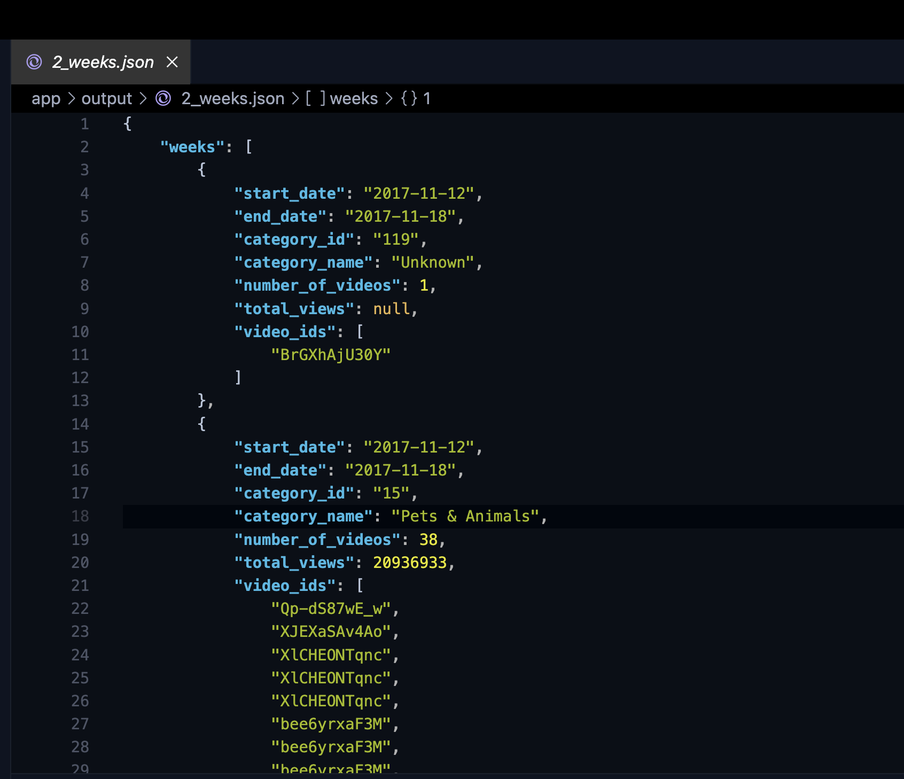
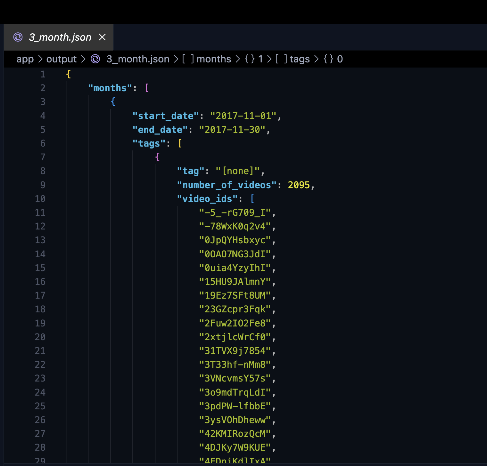
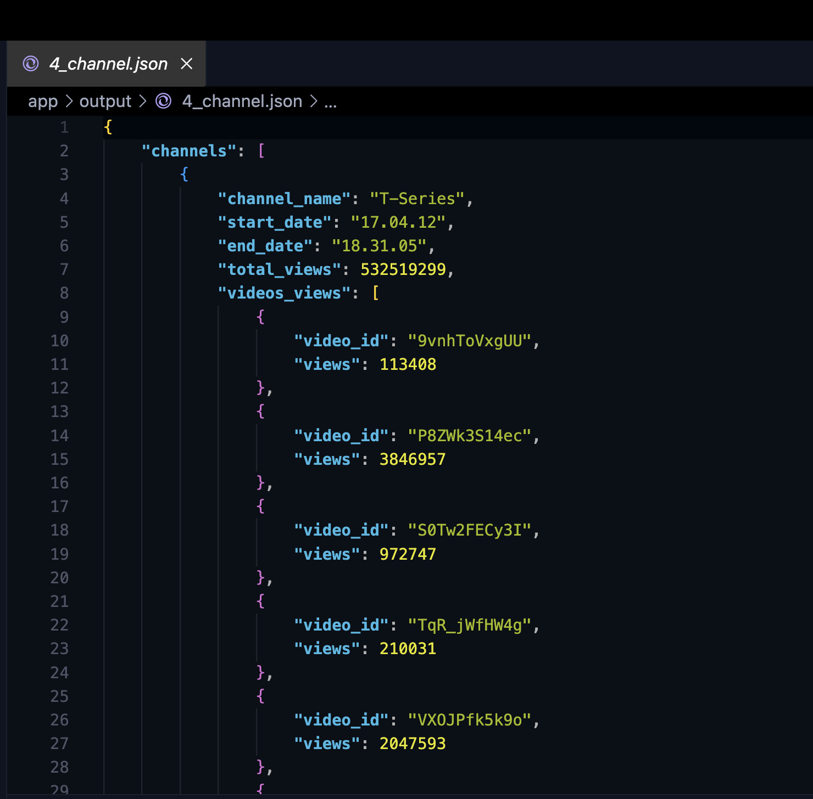
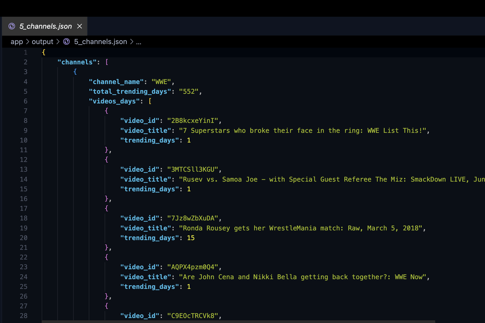
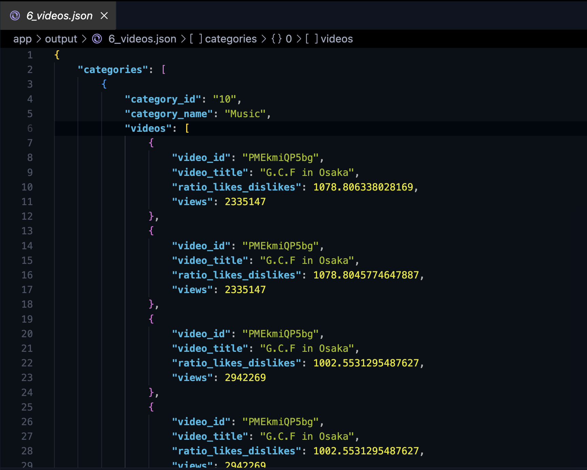

# Homework 10

**Author:** Anna Monastyrska

📝 **Description**  
This homework focuses on processing and analyzing YouTube trending video data using Apache Spark inside a Dockerized environment. The goals of the project are:

To calculate and aggregate analytical insights (e.g. top trending videos, channels, category-wise stats).

To export results into JSON files.

To automate the setup using Docker and share the results with screenshots and output samples.

**Tasks**
1) Find Top 10 videos that were amongst the trending videos for the highest 
number of days (it doesn't need to be a consecutive period of time). 
You should also include information about different metrics for each day 
the video was trending. The result should have the following schema:
		
{ 
	videos: array [video] 
}

video’s schema:
{ 
	id: String,
	title: String,
	description: String,
	latest_views: Long, // this should be taken from the latest day video was trending
	latest_likes: Long, // this should be taken from the latest day video was trending
	latest_dislikes: Long, // this should be taken from the latest day video was trending
	trending_days: array[trending_day]
}

trending_day’s schema
{
	date: String,
	views: Long,
	likes: Long,
	dislikes: Long
}
<br>
2) Find what was the most popular category for each week (7 days slices). 
Popularity is decided based on the total number of views for videos of 
this category. Note, to calculate it you can’t just sum up the number of views.
If a particular video appeared only once during the given period, it shouldn’t be 
counted. Only if it appeared more than once you should count the number of new 
views. For example, if video A appeared on day 1 with 100 views, then on day 4 
with 250 views and again on day 6 with 400 views, you should count it as 400 - 100 = 300. 
For our purpose, it will mean that this particular video was watched 300 times 
in the given time period.  The result should have the following schema:

{
	weeks: array[week]
}

week’s schema
{ 
	start_date: String,
	end_date: String,
	category_id: Int,
	category_name: String,
	number_of_videos: Long,
	total_views: Long,
	video_ids: array[String]
}
<br>
3) What were the 10 most used tags amongst trending videos for each 30days time period? 
Note, if during the specified period the same video appears multiple times, 
you should count tags related to that video only once. The result should have the following 
schema:

{
	months: array[month]
}

month’s schema:
{ 
	start_date: String,
	end_date: String,
	tags: array[tag_stat]
}

tag_stat’s schema:
{
	tag: String,
	number_of_videos: Long,
	video_ids: array[String]
}

<br>
4) Show the top 20 channels by the number of views for the whole period. 
Note, if there are multiple appearances of the same video for some channel, 
you should take into account only the last appearance (with the highest 
number of views). The result should have the following schema:

{
	channels: array[channel]
}

channel’s schema:
{ 
	channel_name: String,
	start_date: String,
	end_date: String,
	total_views: Long,
	videos_views: array[video_stat]
}

video_stat’s schema:
{
	video_id: String, 
	views: Long
}

<br>
5) Show the top 10 channels with videos trending for the highest number of days 
(it doesn't need to be a consecutive period of time) for the whole period. 
In order to calculate it, you may use the results from the question №1. 
The total_trending_days count will be a sum of the numbers of trending days 
for videos from this channel. The result should have the following schema:

{
	channels: array[channel]
}

channel’s schema
{ 
	channel_name: String,
	total_trending_days: String,
  videos_days: array[video_day]
}

video_day schema:
{
	video_id: String, 
	video_title: String, 
	trending_days: Long
}

<br>
6) Show the top 10 videos by the ratio of likes/dislikes for each category 
for the whole period. You should consider only videos with more than 100K views. 
If the same video occurs multiple times you should take the record when 
the ratio was the highest. The result should have the following schema:

{
	categories: array[category]
}

category’s schema:
{ 
	category_id: Int,
	category_name: String,
	videos: array[video] 
}

video’s schema:
{ 
	video_id: String,
	video_title: String,
	ratio_likes_dislikes: Double,
	views: Long
}
**Project structure**

.
├── app
│   ├── data
│   │   ├── CA_category_id.json
│   │   ├── CAvideos.csv
│   │   ├── DE_category_id.json
│   │   ├── DEvideos.csv
│   │   ├── FR_category_id.json
│   │   ├── FRvideos.csv
│   │   ├── GB_category_id.json
│   │   ├── GBvideos.csv
│   │   ├── IN_category_id.json
│   │   ├── INvideos.csv
│   │   ├── JP_category_id.json
│   │   ├── JPvideos.csv
│   │   ├── KR_category_id.json
│   │   ├── KRvideos.csv
│   │   ├── MX_category_id.json
│   │   ├── MXvideos.csv
│   │   ├── RU_category_id.json
│   │   ├── RUvideos.csv
│   │   ├── US_category_id.json
│   │   └── USvideos.csv
│   ├── main.py
│   └── output
│       ├── 1_videos.json
│       ├── 2_weeks.json
│       ├── 3_month.json
│       ├── 4_channel.json
│       ├── 5_channels.json
│       └── 6_videos.json
├── docker-compose.yml
├── Readme.md
└── run.sh

🖥️ **Usage**

### How to run the application

1. **Clone the repository**

    ```bash
    git clone <repository-url>
    cd <repository-folder>
    ```
2. **Add data folder**
    Add data folder in the same way as it is shown in project structure
    Create folder output in the same way as it is shown in project structure

3. **Run docker compose:**

    ```bash
    docker compose up
    ```

4. **Run ./run.sh:**

    ```bash
    chmod +x run.sh
    ./run.sh
    ```


### Results






